# Ollive Observability Platform Architecture

This document provides a deep-dive architectural review of the Ollive LLM Inference Ingestion and Observability System. It covers data flow, design decisions, scaling, and recovery strategies required for a production-grade deployment at 10M+ daily requests.

---

## 🗺 System Ingest & Ingestion Pipeline Flow

```mermaid
sequenceDiagram
    autonumber
    actor Client as User Browser
    participant Server as Express Server
    participant SDK as LLM SDK (EventEmitter)
    participant Pipeline as Ingestion Pipeline
    participant DB as SQLite DB (WAL)
    
    Client->>Server: POST /api/chat { provider, model, message }
    Note over Server: Inserts User Message to DB
    Server->>SDK: sdk.chat(provider, model, history)
    SDK->>Client: Stream text deltas (SSE)
    
    rect rgb(20, 20, 40)
        Note over SDK: Client clicks Cancel or Disconnects
        Client-->>Server: Closes Connection / PATCH /api/sessions/cancel
        Server->>SDK: controller.abort()
        Note over SDK: Aborts LLM API Fetch stream
    end
    
    SDK-->>Server: Yields final 'done' chunk
    Note over Server: Inserts Assistant Message to DB
    
    Note over SDK: Calculates Latency, TTFT, TPS, Cost
    SDK-xPipeline: emit('log', rawLogPayload)
    
    rect rgb(30, 20, 40)
        Note over Pipeline: Async Validation & PII Redaction
        Pipeline->>Pipeline: redact(input_preview & output_preview)
        Pipeline->>Pipeline: Enrich tokens/sec & lookup Cost
        Pipeline->>DB: insertLog() (Prepared SQL Statement)
        Pipeline->>DB: updateSessionTotals()
    end
    
    Client->>Server: GET /api/metrics (Polling 5s)
    Server->>DB: SELECT aggregations (P50/P95)
    DB-->>Client: Refreshes Live Charts & Logs
```



---

## 🏛 Telemetry Event Lifecycle

The telemetry ingestion lifecycle follows a strictly ordered, multi-phased pipeline designed to guarantee **safety, isolation, and accuracy** before persistent storage:

```
[SDK Log Event]
      │
      ▼
┌──────────────┐
│  Validation  │ ──(Reject malformed fields / incorrect enum status)──► [Discard & Log Warning]
└──────────────┘
      │
      ▼
┌──────────────┐
│ PII Redactor │ ──(Scan Email, Phone, SSN, API Key, Credit Cards)──► [Replace with Redacted Tokens]
└──────────────┘
      │
      ▼
┌──────────────┐
│ Enrichment   │ ──(Calculate Throughput (TPS), Estimate Cost)
└──────────────┘
      │
      ▼
┌──────────────┐
│  Ingestion   │ ──(Write log row & atomic increment on sessions)──► [SQLite WAL DB]
└──────────────┘
```

---

## 🚀 Scaling Ollive to 10M+ Daily Logs (Production Roadmap)

To move this system from a highly concurrent local environment to an enterprise production footprint, the following architectural upgrades are recommended:

### 1. Ingestion Layer: Swap Event-Emitter for Redis Streams
* **Current:** Decoupled via Node's memory-based `EventEmitter`. This is single-process and vulnerable to data loss if the process crashes before writing to the database.
* **Production:** Publish SDK logs to a **Redis Stream** or **Apache Kafka** cluster. Redis Streams provide high-throughput, low-latency queues with consumer groups, enabling horizontal scaling of pipeline ingestion worker processes independently of the main API servers.

### 2. Storage Layer: SQLite to TimescaleDB / PostgreSQL
* **Current:** SQLite `WAL` mode.
* **Production:** Deploy **TimescaleDB** (a PostgreSQL extension for time-series data). Log tables are partitioned into time-based chunks (hypertables), allowing extremely fast queries over rolling intervals and automatic retention roll-offs.

### 3. Metric Aggregation: Rollups & HyperLogLog
* **Current:** P50/P95 latencies are calculated on-the-fly using offset sorting over raw log rows.
* **Production:** For millions of logs, on-the-fly percentile calculations become slow. Use:
  1. **Continuous Aggregations** (TimescaleDB) to automatically pre-compute p50, p95, and error rates every 1 minute.
  2. **HyperLogLog** (Redis or Postgres) for fast, approximate unique counts (e.g. active users, unique session distributions).

### 4. Backpressure & Buffered Writes
* **Current:** Every log event executes a direct database write.
* **Production:** Buffer logs in-memory (or in Redis) and perform **bulk inserts** (e.g., 500 logs per insert or every 100ms). This drastically reduces disk I/O bottlenecks and increases throughput by up to 20x.

---

## 🛡 Failure Handling, Redundancy & Alerts

* **SDK Circuit Breaking:** If an external LLM provider goes down (or hits a rate limit), the SDK automatically intercepts the `503` or `429` status code, yields an `error` chunk to keep the client informed, logs the failure to the DB, and can trigger automatic fallback to another active provider.
* **Database Write Failures:** The Ingestion pipeline catches SQLite write exceptions. In a distributed setup, failed writes are published to a Dead Letter Queue (DLQ) in Redis/Kafka for manual replay or retry, preventing loss of auditing data.
* **Ingestion Graceful Degradation:** If the database becomes unresponsive, the ingestion pipeline can temporarily buffer log records in Redis until the database returns online.
