```mermaid
sequenceDiagram
    autonumber
    actor Client as User Browser
    participant Server as Express Server
    participant SDK as LLM SDK (EventEmitter)
    participant Pipeline as Ingestion Pipeline
    participant DB as SQLite DB (WAL)
    
    Client->>Server: POST /api/chat { provider, model, message }
    Note over Server: Inserts User Message to DB
    Server->>SDK: sdk.chat(provider, model, history)
    SDK->>Client: Stream text deltas (SSE)
    
    rect rgb(20, 20, 40)
        Note over SDK: Client clicks Cancel or Disconnects
        Client-->>Server: Closes Connection / PATCH /api/sessions/cancel
        Server->>SDK: controller.abort()
        Note over SDK: Aborts LLM API Fetch stream
    end
    
    SDK-->>Server: Yields final 'done' chunk
    Note over Server: Inserts Assistant Message to DB
    
    Note over SDK: Calculates Latency, TTFT, TPS, Cost
    SDK-xPipeline: emit('log', rawLogPayload)
    
    rect rgb(30, 20, 40)
        Note over Pipeline: Async Validation & PII Redaction
        Pipeline->>Pipeline: redact(input_preview & output_preview)
        Pipeline->>Pipeline: Enrich tokens/sec & lookup Cost
        Pipeline->>DB: insertLog() (Prepared SQL Statement)
        Pipeline->>DB: updateSessionTotals()
    end
    
    Client->>Server: GET /api/metrics (Polling 5s)
    Server->>DB: SELECT aggregations (P50/P95)
    DB-->>Client: Refreshes Live Charts & Logs
```

# Ollive Observability Platform Architecture

This document provides a technical overview of the Ollive LLM inference ingestion and observability system. It covers data flow, database transaction boundaries, concurrency management, and the horizontal scaling roadmap for high-throughput deployments.

---

## Telemetry Ingestion and Pipeline Flow

The sequence diagram below illustrates the decoupled lifecycle of a chat request and its corresponding telemetry logging:



---

## Telemetry Event Lifecycle

The telemetry ingestion process handles incoming log validation, compliance sanitization, and database updates in discrete, isolated steps to keep the main server responsive:

```
[SDK Log Event]
      │
      ▼
┌──────────────┐
│  Validation  │ ──(Discard and log warning if required fields are missing)
└──────────────┘
      │
      ▼
┌──────────────┐
│ PII Redactor │ ──(Scan emails, phones, SSNs, CCs, API keys via background worker pool)
└──────────────┘
      │
      ▼
┌──────────────┐
│ Enrichment   │ ──(Calculate output tokens/sec and lookup cost models)
└──────────────┘
      │
      ▼
┌──────────────┐
│  Ingestion   │ ──(Write log row and update session counters in a transaction)
└──────────────┘
```

---

## Production Scaling Roadmap

To scale this architecture from a single-node local runtime to an enterprise distributed environment (10M+ daily transactions), we recommend the following migrations:

### Ingestion Queue: EventEmitter to Redis Streams / Kafka
* **Current:** Node's internal `EventEmitter` manages the asynchronous log handoff. This is process-bound; if the server crashes or restarts, any log in the in-memory queue is lost.
* **Production:** Publish log events to a **Redis Stream** or a **Kafka** topic. This decouples ingestion horizontally, letting you scale ingestion workers independently of the Express web pods while ensuring durable message queueing.

### Database: SQLite WAL to PostgreSQL / TimescaleDB
* **Current:** Local SQLite database in Write-Ahead Logging (WAL) mode.
* **Production:** Migrate to **TimescaleDB** or **PostgreSQL** read-replicas. TimescaleDB partitions the telemetry logs by time intervals (hypertables), maintaining high write throughput and allowing automatic database retention roll-offs without table locks.

### Aggregations: Pre-Computed Rollups
* **Current:** Percentile latencies (P50/P95) are calculated on-the-fly directly from the raw log rows in SQLite.
* **Production:** For massive datasets, on-the-fly sorting becomes slow. Configure **Continuous Aggregations** in TimescaleDB to pre-compute percentiles and error metrics on a rolling 1-minute interval, serving the dashboard instantly.

### Backpressure Control
* **Current:** The pipeline buffers log entries in memory and flushes them to SQLite in transactions when reaching the batch size limit or after a 1-second timeout.
* **Production:** Maintain this batch-transaction pattern on the ingestion workers, scaling the queue size and using a distributed cache (like Redis) as a buffer layer to protect the primary database from write spikes.

---

## Failure Handling, Redundancy, & Recovery

* **SDK Circuit Breaking:** If an external LLM API goes down or returns a rate-limit code (429/503), the SDK intercepts the exception, yields an error chunk to the client, writes the failure event to the logs, and routes subsequent requests to a configured fallback provider.
* **Ingestion Dead-Letter Queues (DLQ):** If the primary database is locked or unavailable, the ingestion worker catches the write error and publishes the failed log block to a Dead-Letter Queue (DLQ) in Redis or Kafka for automated retries once the database is back online.
* **Graceful Shutdown Guards:** The web server hooks into process signals (`SIGTERM`/`SIGINT`). When triggered, it terminates worker threads, runs a final synchronous flush of the batch queue to SQLite, and closes the database connection cleanly to prevent database corruption or telemetry gaps.
